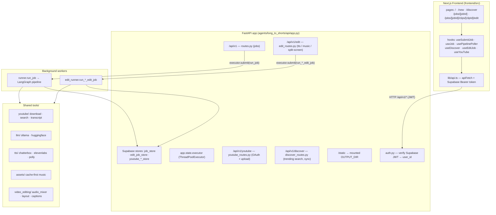
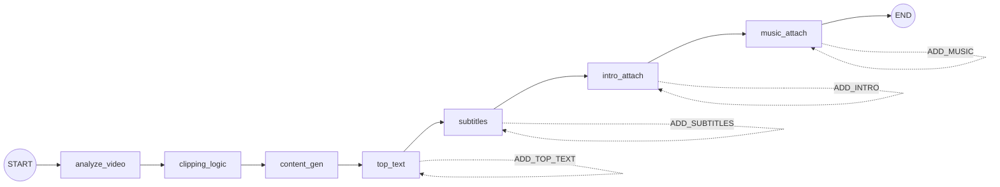
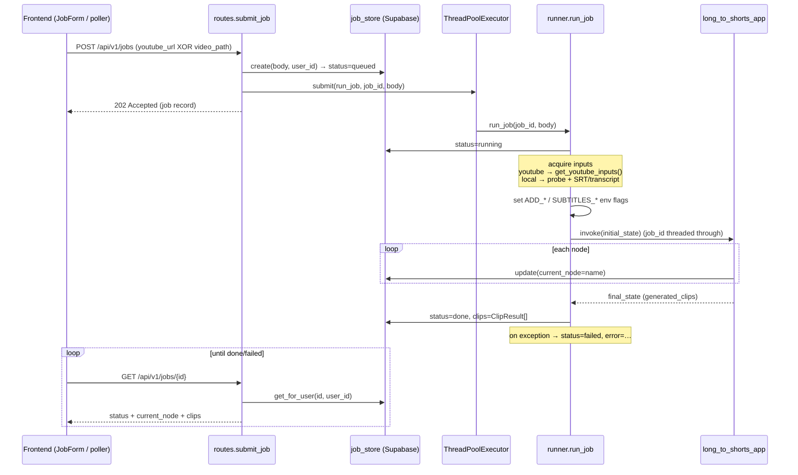
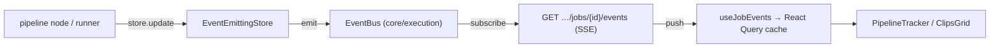

# YTShortsEngineer — Architecture & Code Flow

An AI pipeline that turns **long-form YouTube videos into vertical (9:16) short
clips**, with title/hook/hashtag generation, subtitles, intros, and background
music — exposed via a FastAPI backend, a LangGraph pipeline, and a Next.js
frontend.

> Generated from the codegraph index. Key entry points:
> `agents/long_to_shorts/graph.py` (topology) · `agents/long_to_shorts/api/runner.py`
> (orchestration) · `agents/long_to_shorts/api/app.py` + `api/routes.py` (HTTP) ·
> `agents/long_to_shorts/_logging_utils.py` (progress bridge) ·
> `frontend/src/lib/api.ts` + `frontend/src/hooks/usePipelinePoller.ts` (client).

---

## 1. High-level system

---

## 2. The core pipeline (LangGraph)

`agents/long_to_shorts/graph.py` builds a **linear** `StateGraph` over
`LongToShortsState` (`agents/state.py`), compiled to `long_to_shorts_app`.

The last four nodes are **optional**, gated by env flags the runner sets from the
request (`ADD_TOP_TEXT`, `ADD_SUBTITLES`, `ADD_INTRO`, `ADD_MUSIC`). Each node
short-circuits internally if its flag is off, so the **topology stays fixed**.

Each file pairs a thin `*_node(state)` wrapper with a `_*_impl(state)`:

| Node | File | What it does |
|---|---|---|
| `analyze_video` | `analyze_video_node.py` | Chunks the transcript (prefers exact `timed_transcript` captions, else calibrates chars-per-second from probed duration), LLM hook-scores each chunk → JSON, guarantees min clip length, filters anything past video end, keeps **top-N** by `hook_score`. Synthetic 60s fallback if LLM unavailable. Emits `analyzed_segments: List[ClipObject]`. |
| `clipping_logic` | `clipping_logic_node.py` | **Map phase**: validates/probes each unique source, clamps timestamps, extracts clips in parallel via `ThreadPoolExecutor` + ffmpeg (`portrait` 9:16 or `fullscreen`). Resolves the per-run `clips_dir` (keyed by `job_id`) that all downstream nodes write into. |
| `content_gen` | `content_gen_node.py` | Per clip: pulls transcript excerpt, LLM (with retry/backoff) → **title, summary, hook_text, hashtags, mood**; `mood` validated against `AudioTheme`. Best-effort music recommendation via the cache-first asset layer (`tools.assets.retrieve`). |
| `top_text` | `top_text_node.py` | Burns the hook-text overlay at the top of each clip. |
| `subtitles` | `subtitles_node.py` | Whisper transcription (or reuses an SRT) + burns subtitles at the configured position/size. |
| `intro_attach` | `intro_attach_node.py` | Prepends a title-card intro and crossfades (`_concat_with_xfade`). |
| `music_attach` | `music_attach_node.py` | Mixes recommended background music under the clip. |

**Instrumentation** — every node wraps its body in `node_stage(state, name)`
(`_logging_utils.py`), which logs `START`/`END`/`FAILED` and calls
`job_store.update(job_id, current_node=name)`. **This is the bridge that gives the
frontend live per-stage progress.**

---

## 3. Request → result flow (the happy path)

Helpers in `run_clipping_workflow.py` (`get_youtube_inputs`, `probe_video`,
`get_transcript`) are **shared** between the CLI entry point and the API runner to
avoid duplication.

---

## 4. The edit & publish surface (post-pipeline, per clip)

From a finished clip's edit page, the frontend calls `/api/v1/edit/*` (and
`/youtube/*`). Each is an async job mirroring the main pattern: route validates
ownership → `edit_job_store.create` → `executor.submit(run_*_edit_job)` → poll via
`useEditJob`.

- **TTS** (`run_tts_edit_job`): standalone `narration.mp3`, or *attach mode* —
  render TTS audio → 9:16 intro video → crossfade onto the clip (reusing
  `intro_attach_node._concat_with_xfade`).
- **Music** (`run_music_edit_job`): resolve music by precedence
  `explicit path > upload_id > theme` (theme → 4-tier `AudioFetcher`), then
  `mix_background_music`.
- **Split-screen** and **YouTube upload** follow the same shape.

Outputs land under `OUTPUT_DIR/edits/{edit_job_id}/…` and are exposed as
`/static/...` URLs via `_to_static_url`.

---

## 5. Cross-cutting concerns

- **Auth** (`api/auth.py`): every route depends on `get_current_user_id`, which
  verifies a Supabase JWT (RS256 via JWKS or HS256 via secret).
  `AUTH_DISABLED=true` returns a fixed dev user. The frontend attaches the token in
  `apiFetch`; a 401 redirects to `/login`.
- **Persistence**: Supabase-backed `SupabaseJobStore` etc. Workers write via the
  **service-role client** (bypasses RLS, no JWT); routes read/write scoped by
  `user_id` (`get_for_user`, `list_for_user`).
- **Pluggable providers** under `tools/`: LLM (`ollama`/`huggingface`), TTS
  (`chatterbox`/`elevenlabs`/`streamlabs_polly`), and a **cache-first asset layer**
  (`tools/assets/` — `retrieve`/`AssetQuery`/`registry`/`store`) that warms a music
  cache keyed by mood/theme (Pixabay/Freesound).
- **Concurrency**: one app-level `ThreadPoolExecutor` runs jobs off the request
  thread; `clipping_logic` uses its *own* pool for parallel ffmpeg extraction.
- **Resilience**: LLM steps degrade gracefully (synthetic segments, placeholder
  metadata, retries); music is always best-effort and never fatal to a job.

---

## 6. Type contract

`frontend/src/types/api.ts` is explicitly kept in sync with `api/models.py`
(`JobRequest` / `ClipResult` / `EditJob` / `DiscoverVideo` …), so the FastAPI
Pydantic models are the single source of truth flowing both ways.

---

## 7. Execution layer (event-driven · cached · resumable)

A set of interface-backed abstractions decouples the pipeline from the in-process
runtime so it can scale to distributed workers without rewrites. Defaults are
in-process / local; production backends are config-only swaps.

### 7.1 Real-time updates (SSE) — replaces polling

- `core/execution/eventbus.py` — `EventBus` (in-process `asyncio.Queue` fan-out;
  worker threads publish via `loop.call_soon_threadsafe`). `RedisEventBus` is the
  documented swap for cross-machine fan-out (`EVENT_BUS_BACKEND=redis`).
- **Single emission seam**: `api/event_store.py::EventEmittingStore` wraps the
  job / edit / upload stores so every `update()` publishes the updated record on
  the resource's channel — no `emit()` calls scattered through nodes.
- `api/events_routes.py` — SSE endpoints (`…/jobs/{id}/events`,
  `…/edit/jobs/{id}/events`, `…/youtube/uploads/{id}/events`). Auth via a
  short-lived JWT in the query string (EventSource can't set headers). Sends a
  snapshot on connect, then deltas; heartbeats every 15s; closes on terminal.
- Frontend: `hooks/useJobEvents.ts` writes events into the **same** React Query
  cache `useJob` reads, so `PipelineTracker`/`ClipsGrid` are unchanged. Polling
  remains as a slow safety-net (and full fallback via `NEXT_PUBLIC_SSE_ENABLED=0`).

### 7.2 Unified cache (`core/cache`) — content-addressable

- `cache_key = sha256(operation | stage_version | canonical_json(inputs))` — the
  key *is* the deterministic artifact id, so the cache doubles as the idempotency
  "skip if exists" mechanism.
- `ArtifactCache.get_or_compute_json` memoizes JSON results (video probe, Whisper
  transcript, LLM hook-scoring, LLM content-gen); `materialize_blob` content-
  addresses large media (ffmpeg clip extraction) via a `BlobStore`
  (`LocalBlobStore` now → CAS dir; `S3BlobStore` later) so identical work is
  reused across jobs (and across machines once on object storage).
- Index in Supabase `cache_entries` (prod) or local SQLite (dev). Gated by
  `CACHE_ENABLED`. Generalizes the proven `tools/assets/` music-cache pattern.

### 7.3 Idempotency & resumability (Part 3)

- **Execution journal / checkpoints**: Supabase `job_stages` (one row per
  job × stage) written by `_logging_utils.node_stage` via `api/stage_store.py` —
  durable, cross-process record of started / complete / failed stages.
- **Resume**: a re-run gets cache hits for every expensive stage (§7.2), so it is
  cheap and produces no duplicate clips; the journal records what already
  completed. CLI `run_id` is now a deterministic hash of inputs (was random).
- **YouTube no-double-upload**: a deterministic `idempotency_key`
  (`youtube_upload_runner.py`) lets a retry detect an already-completed upload and
  reconcile instead of re-publishing; the result is persisted with retry.

### 7.4 Decoupled execution (`TaskQueue`)

- `core/execution/taskqueue.py` — routes call `app.state.task_queue.enqueue(...)`
  instead of `executor.submit(...)`. Default `ThreadPoolTaskQueue`; `Celery` /
  `Temporal` implementations are drop-in (`TASK_QUEUE_BACKEND`). `core/execution/
  lifecycle.py` holds the job/stage state-machine transitions in one place.

**Scaling path**: stateless API replicas + `RedisEventBus` (fan-out) +
`S3BlobStore` (shared artifacts) + a real `TaskQueue` broker (distributed workers)
+ Supabase as the shared journal/cache index — each swap independent behind its
interface.
